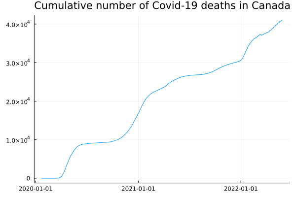

## Loading a Julia object

We will load the object we saved in the last chapter into this session so that we can plot the data.

To successfully load the BSON file and recreate our DataFrame, we need to load in this session all the packages that were involved in the creation of the DataFrames so that the necessary types are available to Julia.

In addition, we will load the  which is a version of the  with some additional statistical functionality:

``` julia
using BSON
using DataFrames
using Dates          # from the standard Julia library
using TimeSeries
using StatsPlots
```

Plots (and thus StatsPlots) is built on top of various visualization backends (e.g.  or ). This allows to use the same code to run any of these backends. The GR framework is used by default.


We can now load our BSON file and recreate our DataFrame:


``` julia
BSON.@load "deaths_canada.bson" deaths_canada
```

## Time series

Our data is a time series and needs to be transformed into a TimeArray thanks to the `TimeArray` function from the TimeSeries package before it can be plotted:

``` julia
deaths_canada = TimeArray(deaths_canada, timestamp = :date)
```

    861×1 TimeArray{Int64, 1, Date, Vector{Int64}} 2020-01-22 to 2022-05-31
    │            │ number_deaths_sum │
    ├────────────┼───────────────────┤
    │ 2020-01-22 │ 0                 │
    │ 2020-01-23 │ 0                 │
    │ 2020-01-24 │ 0                 │
    │ 2020-01-25 │ 0                 │
    │ 2020-01-26 │ 0                 │
    │ 2020-01-27 │ 0                 │
    │ 2020-01-28 │ 0                 │
    │ 2020-01-29 │ 0                 │
    │ 2020-01-30 │ 0                 │
    │ 2020-01-31 │ 0                 │
    │ 2020-02-01 │ 0                 │
    │ ⋮          │ ⋮                 │
    │ 2022-05-22 │ 40740             │
    │ 2022-05-23 │ 40740             │
    │ 2022-05-24 │ 40745             │
    │ 2022-05-25 │ 40838             │
    │ 2022-05-26 │ 40952             │
    │ 2022-05-27 │ 41016             │
    │ 2022-05-28 │ 41039             │
    │ 2022-05-29 │ 41042             │
    │ 2022-05-30 │ 41043             │
    │ 2022-05-31 │ 41070             │

We are now ready to create a plot.

## Creating a plot

Creating a plot is very simple:

``` julia
plot(deaths_canada)
```


## Customization

Of course, some amount of tweaking is needed to make a plot nicer. Here, let's simply add a title and remove the unnecessary legend:

``` julia
plot(deaths_canada, title="Cumulative number of Covid-19 deaths in Canada", legend=false)
```



## Comments & questions
